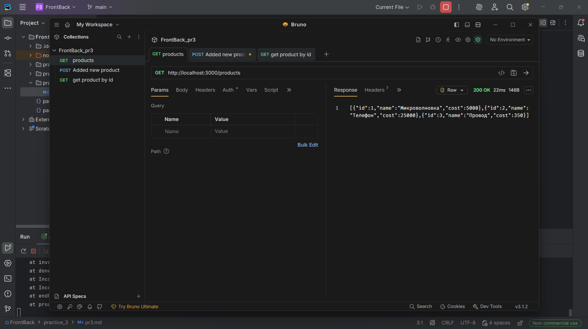
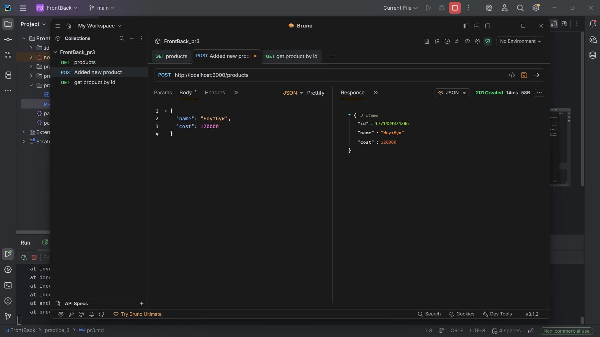
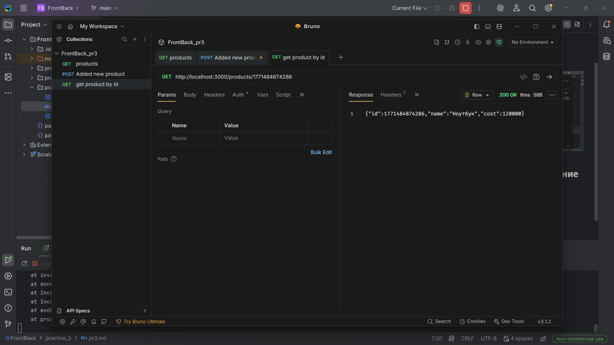
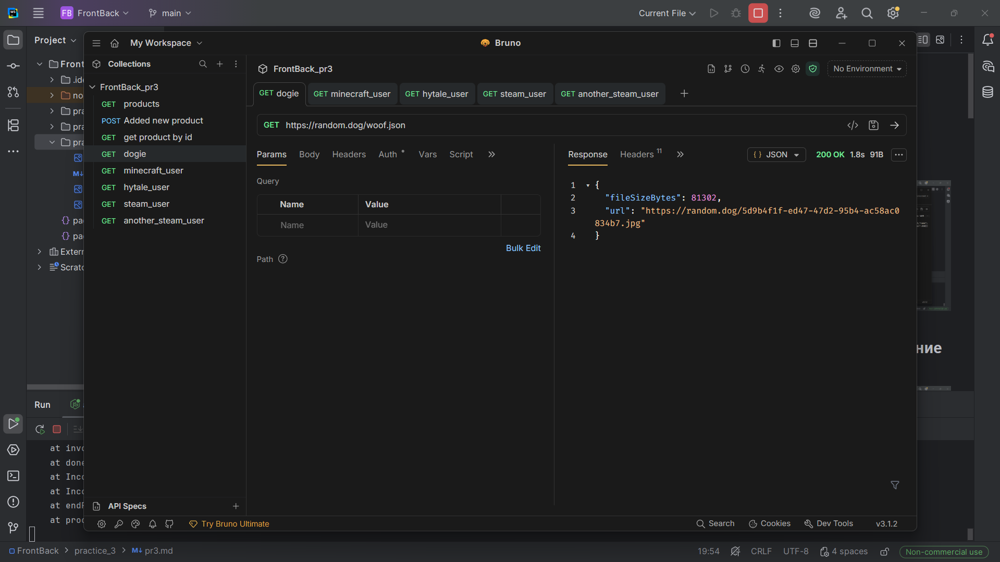
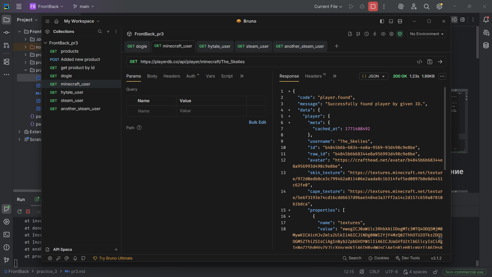
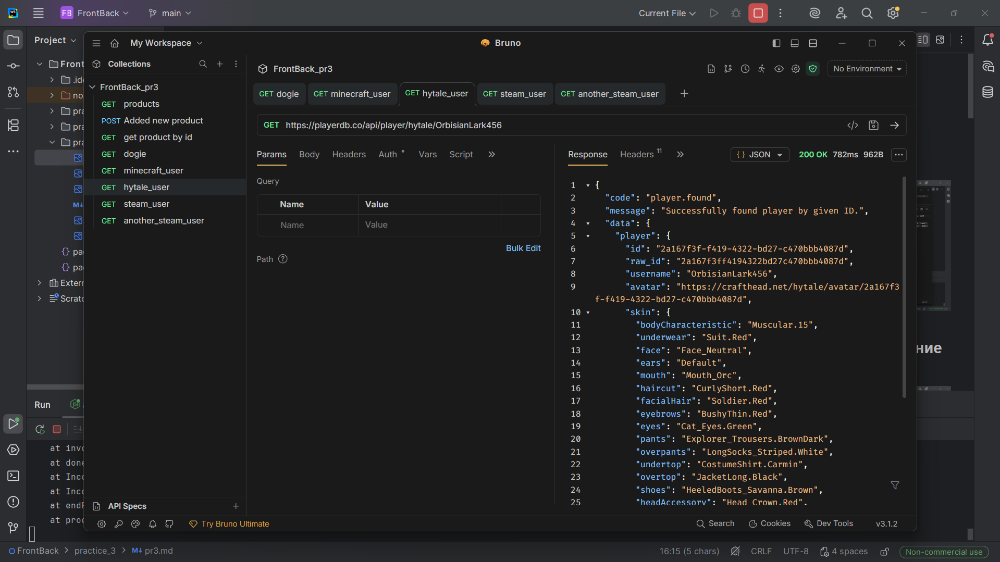
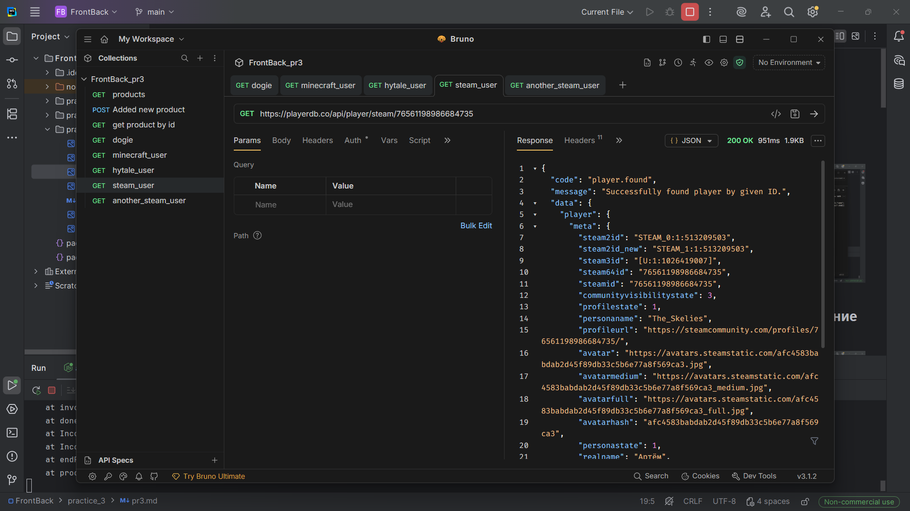
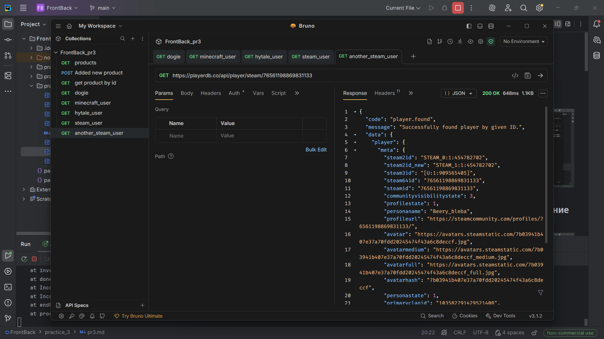

# Практика 3
## 1) get-запрос по выводу товаров

## 2) post-запрос на добавление товара

## 3) get-запрос по выводу товара по его id

## [PlayerDB](https://playerdb.co/)
## 1) get-запрос по выводу картинки собаки

## 2) get-запрос по выводу информации аккаунта Minecraft

## 3) get-запрос по выводу информации аккаунта Hytale

## 4) get-запрос по выводу информации первого аккаунта Steam

## 5) get-запрос по выводу информации аккаунта Steam
